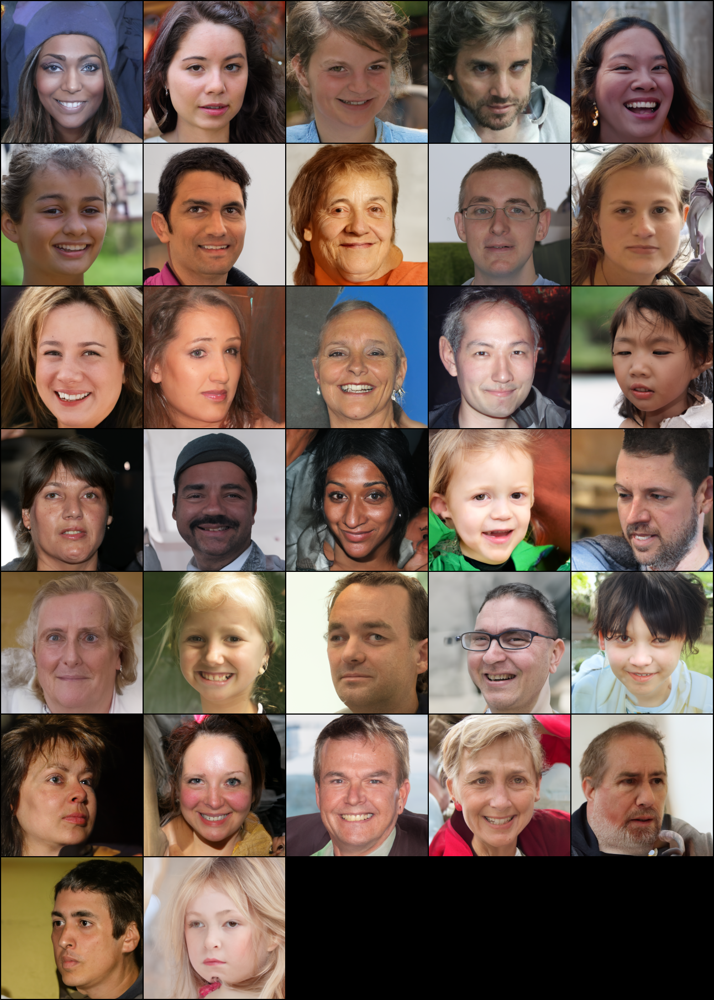

# Score-Based Generative Modeling through Stochastic Differential Equations

This repo contains a PyTorch implementation for the paper [Score-Based Generative Modeling through Stochastic Differential Equations](https://openreview.net/forum?id=PxTIG12RRHS)

by [Yang Song](https://yang-song.github.io), [Jascha Sohl-Dickstein](http://www.sohldickstein.com/), [Diederik P. Kingma](http://dpkingma.com/), [Abhishek Kumar](http://users.umiacs.umd.edu/~abhishek/), [Stefano Ermon](https://cs.stanford.edu/~ermon/), and [Ben Poole](https://cs.stanford.edu/~poole/)

--------------------

We propose a unified framework that generalizes and improves previous work on score-based generative models through the lens of stochastic differential equations (SDEs). In particular, we can transform data to a simple noise distribution with a continuous-time stochastic process described by an SDE. This SDE can be reversed for sample generation if we know the score of the marginal distributions at each intermediate time step, which can be estimated with score matching. 

Our work enables a better understanding of existing approaches,  new sampling algorithms, exact likelihood computation, uniquely identifiable encoding, latent code manipulation, and brings new conditional generation abilities (including but not limited to class-conditional generation, inpainting and colorization) to the family of score-based generative models.

All combined, we achieved an FID of **4.96** for unconditional generation on FFHQ, as well as high-fidelity generation of **1024px** Celeba-HQ images.

**Full results:** [Google Drive Folder] https://drive.google.com/drive/folders/18cSn541cqObsMHEshehrSZ9UcrzI3XaG
